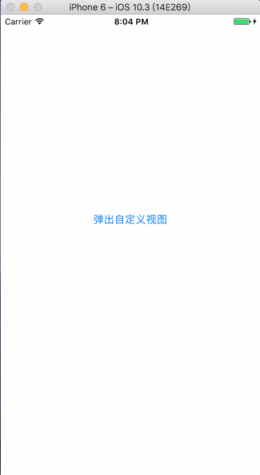

# CustomPopView
## 预览


## 介绍
基于UIView封装的视图弹出，功能简单，快速集成。
通过block将点击事件回调给调用者。

## 安装 
将CustomPopView文件全部考到项目工程中即可。
## 使用 
- 初始化弹出视图

```
    //初始化需要弹出的view
    UIView *vp = [[UIView alloc] initWithFrame:CGRectMake(0, 0, 300, 150)];
    vp.backgroundColor = [UIColor redColor];
    
    //将需要弹出的view添加到customView
    CustomPopView *customView = [[CustomPopView alloc] initWithFrame:self.view.bounds withShowView:vp];
    [customView showAnimationPopView];
    
    [customView setCustomPopViewCallBack:^(id obj) {
        NSLog(@"%@",obj);
    }];
    
    //将customview添加到当前视图中
    [self.view addSubview:customView];
```
- 可参见Demo


